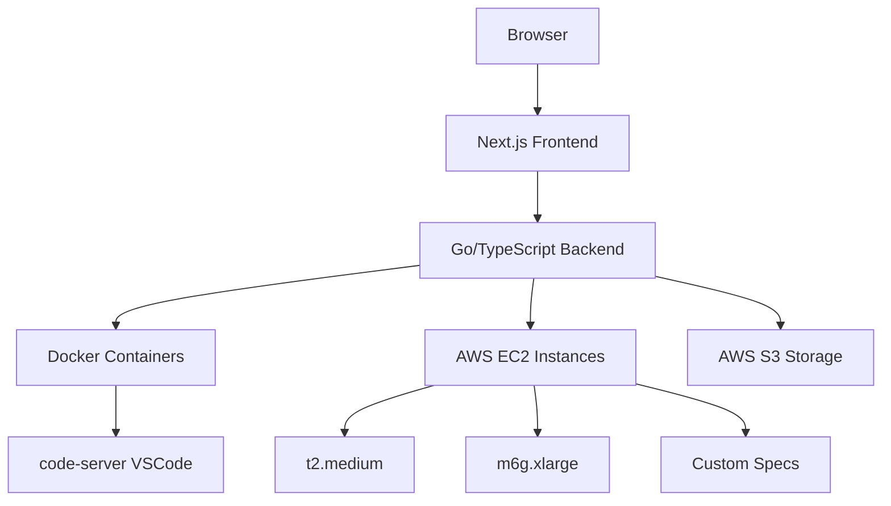

<div align="center">
  
  
  # Dev8.dev
  
  **🚀 The Future of Cloud Development Environments**
  
  *Launch customizable VS Code instances in the cloud with zero setup. Code anywhere, anytime.*
  
  [](https://discord.gg/xE2u4b8S8g)
  [](https://github.com/VAIBHAVSING/Dev8.dev/actions/workflows/ci.yml)
  [](https://github.com/VAIBHAVSING/Dev8.dev/actions/workflows/dependencies.yml)
  [](https://opensource.org/licenses/MIT)
  [](LICENSE)
  [](https://github.com/VAIBHAVSING/Dev8.dev/stargazers)
  
  ---
  
  **[🌟 Try Demo](https://dev8.dev)** • **[📖 Documentation](https://docs.dev8.dev)** • **[💬 Discord](https://discord.gg/xE2u4b8S8g)** • **[🐛 Report Bug](https://github.com/VAIBHAVSING/Dev8.dev/issues)**
  
</div>

## ✨ What is Dev8.dev?

Dev8.dev is a **cloud-based IDE hosting platform** that revolutionizes how developers work. Think GitHub Codespaces, but with **unlimited flexibility** and **transparent pricing**.

Launch fully-configured VS Code environments in seconds, choose your perfect machine specs, and code from any device with just a browser. No more "it works on my machine" – your entire development environment lives in the cloud.

### 🎯 Perfect For

- **Remote Teams** - Standardized dev environments for everyone
- **Students** - Access powerful development tools from any device
- **Freelancers** - Switch between client projects instantly
- **Enterprises** - Secure, scalable development infrastructure

## 🚀 Key Features

<div align="center">
  <table>
    <tr>
      <td align="center" width="33%">
        <h3>⚡ Instant Launch</h3>
        <p>Go from zero to coding in <strong>30 seconds</strong>. Pre-configured environments with your favorite tools.</p>
      </td>
      <td align="center" width="33%">
        <h3>🎛️ Fully Customizable</h3>
        <p>Choose your <strong>machine specs</strong>, from lightweight t2.medium to powerful m6g.xlarge instances.</p>
      </td>
      <td align="center" width="33%">
        <h3>💾 Persistent Storage</h3>
        <p><strong>Never lose work</strong>. Your files, settings, and extensions persist across sessions.</p>
      </td>
    </tr>
    <tr>
      <td align="center" width="33%">
        <h3>🌐 Code Anywhere</h3>
        <p>Full <strong>VS Code experience</strong> in your browser. iPad, Chromebook, or desktop – it just works.</p>
      </td>
      <td align="center" width="33%">
        <h3>🔒 Enterprise Security</h3>
        <p><strong>SOC 2 compliant</strong> infrastructure with isolated containers and encrypted storage.</p>
      </td>
      <td align="center" width="33%">
        <h3>💰 Transparent Pricing</h3>
        <p><strong>Pay only for what you use</strong>. No hidden fees, no vendor lock-in.</p>
      </td>
    </tr>
  </table>
</div>

## 🏗️ Architecture



### Tech Stack

- **Frontend**: Next.js 15 + TypeScript + Tailwind CSS
- **Backend**: Go + TypeScript microservices
- **IDE**: code-server (VS Code in browser)
- **Containers**: Docker + Kubernetes (planned)
- **Cloud**: AWS (EC2, S3, VPC)
- **Auth**: NextAuth.js + OAuth providers

## 🚀 Quick Start

### For Users

1. **Sign up** at [dev8.dev](https://dev8.dev)
2. **Choose** your machine configuration
3. **Launch** your environment
4. **Start coding** immediately!

### For Developers

```bash
# Clone the repository
git clone https://github.com/VAIBHAVSING/Dev8.dev.git
cd Dev8.dev

# Install dependencies
pnpm install

# Set up environment variables
cp apps/web/.env.example apps/web/.env.local
# Edit .env.local with your configuration

# Start development
pnpm dev
```

## 🐳 Docker Images

Dev8.dev provides pre-configured Docker images with **DevCopilot Agent** for automatic GitHub/Copilot authentication:

### Available Images

| Image              | Languages              | Size   | Features                                    |
| ------------------ | ---------------------- | ------ | ------------------------------------------- |
| **dev8-nodejs**    | Node.js, Bun           | ~1.8GB | code-server, GitHub Copilot, pnpm, yarn     |
| **dev8-python**    | Python 3.11            | ~2.2GB | code-server, Jupyter, poetry, black, pytest |
| **dev8-fullstack** | Node, Python, Go, Rust | ~3.5GB | All languages + code-server + Copilot       |

### Quick Test

```bash
# Build images
cd docker && ./build.sh

# Run Node.js environment
docker run -it --rm \
  -p 8080:8080 -p 2222:2222 \
  -e GITHUB_TOKEN="your_token" \
  dev8-nodejs:latest

# Access VS Code: http://localhost:8080
# SSH: ssh -p 2222 dev8@localhost
```

**DevCopilot Agent** automatically:

- ✅ Authenticates GitHub CLI & installs Copilot
- ✅ Configures Git credentials
- ✅ Sets up SSH keys
- ✅ Starts code-server (browser-based VS Code)
- ✅ Monitors & refreshes authentication

See [docker/README.md](docker/README.md) for detailed documentation.

## 🤖 CI/CD Pipeline

Simple and efficient GitHub Actions pipeline:

### Three Jobs, One Workflow

- **🟦 TypeScript**: Lint → Type Check → Test → Build
- **🟩 Go**: Lint → Format Check → Test → Build
- **�️ Security**: Trivy vulnerability scanning

- **🧹 Linting**: ESLint with strict rules
- **🎨 Code Formatting**: Prettier validation
- **🔒 Type Safety**: TypeScript strict compiler checks
- **🧪 Testing**: Unit and integration tests
- **🏗️ Build Verification**: Next.js application builds
- **📦 Security**: npm audit + CodeQL analysis

#### **🟩 Go Pipeline**

- **🧹 Linting**: go vet + staticcheck
- **🎨 Code Formatting**: gofmt + goimports validation
- **🧪 Testing**: Unit tests with race detection + coverage
- **🏗️ Build Verification**: Binary compilation
- **🔐 Security**: gosec + CodeQL analysis

#### **🛡️ General Security**

- **🔍 Vulnerability Scanning**: Trivy for all dependencies
- **�️ Database Testing**: PostgreSQL migration validation

### Performance Features

- **📦 Smart Caching**: Go modules, pnpm store, build artifacts
- **🎯 Change Detection**: Only runs relevant pipelines based on file changes
- **⚡ Parallel Execution**: Language pipelines run concurrently

### Local Development

Run the same checks locally:

```bash
make ci        # Run full pipeline
make lint      # Lint all code
make test      # Run all tests
make build     # Build everything
```

## 📁 Project Structure

```
Dev8.dev/
├── apps/
│   ├── web/          # Next.js frontend dashboard
│   ├── docs/         # Documentation site
│   └── agent/        # Go backend service
├── packages/
│   ├── ui/           # Shared React components
│   ├── eslint-config/
│   └── typescript-config/
└── infrastructure/   # Cloud infrastructure code
```

## 🌟 Roadmap

<details>
<summary><strong>🎯 Phase 1: MVP (Current)</strong></summary>

- [x] User authentication & dashboard
- [x] AWS EC2 integration
- [x] Basic code-server deployment
- [x] File persistence with S3
- [x] Docker images with DevCopilot Agent
- [x] GitHub Copilot integration
- [x] Multi-language support (Node, Python, Go, Rust)
- [ ] Instance management (start/stop/delete)
- [ ] Basic monitoring & logs

</details>

<details>
<summary><strong>🚀 Phase 2: Scale</strong></summary>

- [ ] Kubernetes orchestration
- [ ] Auto-scaling instances
- [ ] Team collaboration features
- [ ] Custom Docker images
- [ ] SSH/terminal access
- [ ] Billing & usage tracking

</details>

<details>
<summary><strong>🌍 Phase 3: Expand</strong></summary>

- [ ] Multi-cloud support (GCP, Azure)
- [ ] Multiple IDE support (IntelliJ, Vim)
- [ ] Marketplace for extensions/templates
- [ ] API for third-party integrations
- [ ] Enterprise SSO & audit logs

</details>

## 💝 Support the Project

Love Dev8.dev? Here's how you can help us grow:

- ⭐ **Star this repo** to show your support
- 🐛 **Report bugs** and suggest features
- 💬 **Join our [Discord](https://discord.gg/xE2u4b8S8g)** community
- 🤝 **Contribute** code or documentation
- 💰 **Sponsor** our development efforts

<div align="center">
  <a href="https://github.com/sponsors/VAIBHAVSING">
    
  </a>
</div>

## 🤝 Contributing

We welcome contributions from developers of all skill levels! Check out our [Contributing Guide](CONTRIBUTING.md) to get started.

### Development Setup

```bash
# Fork and clone the repo
git clone https://github.com/YOUR_USERNAME/Dev8.dev.git

# Install dependencies
pnpm install

# Run the development servers
pnpm dev
```

## 👥 Community

<div align="center">
  
  **Join thousands of developers building the future of cloud development**
  
  [](https://discord.gg/xE2u4b8S8g)
  
  *Share your ideas, get help, and connect with other developers*
  
</div>

## 📄 License

This project is licensed under the MIT License - see the [LICENSE](LICENSE) file for details.

## 🙏 Acknowledgments

- The amazing [code-server](https://github.com/coder/code-server) team
- [Turborepo](https://turbo.build/) for the fantastic monorepo setup
- Our incredible [Discord community](https://discord.gg/xE2u4b8S8g)

---

<div align="center">
  <p><strong>Built with ❤️ by developers, for developers</strong></p>
  <p>
    <a href="https://dev8.dev">Website</a> •
    <a href="https://docs.dev8.dev">Docs</a> •
    <a href="https://discord.gg/xE2u4b8S8g">Discord</a> •
    <a href="https://twitter.com/dev8_dev">Twitter</a>
  </p>
</div>
