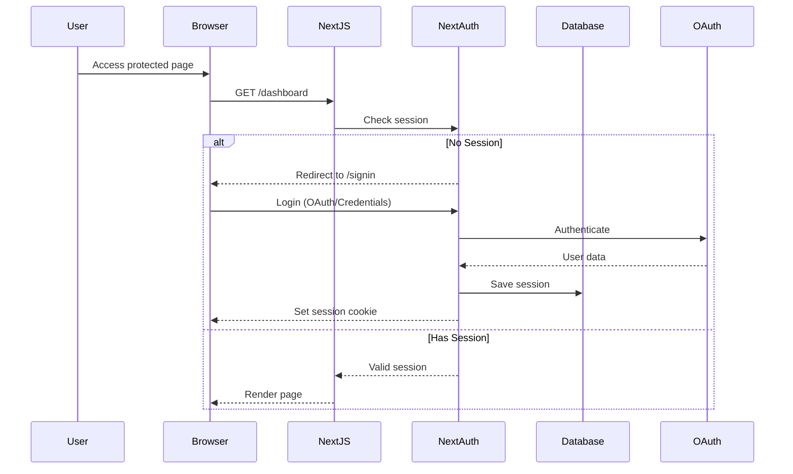
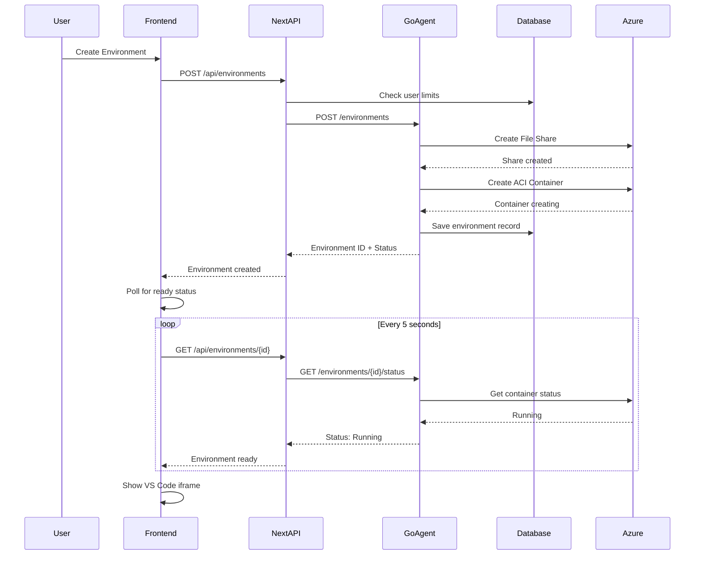
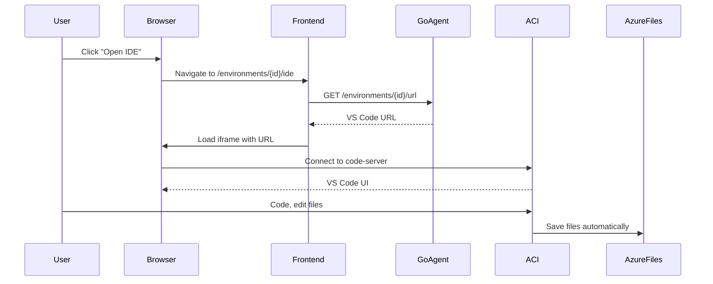

# 🏗️ Dev8.dev System Architecture

## Executive Summary

Dev8.dev is a cloud-based IDE platform built as a **Codespace alternative** using a modern monorepo architecture. The system provides browser-based VS Code environments running in Azure Container Instances with persistent storage.

**Current Status:** MVP Development Phase  
**Architecture:** Monorepo with Next.js frontend + Go backend + Azure ACI  
**Timeline:** 4-week MVP → Feature expansion → Enterprise scaling

---

## 🎯 Architecture Goals

### Primary Goals
1. **Fast Time-to-Market**: Launch MVP in 4 weeks
2. **Scalability**: Support from 10 to 10,000+ users
3. **Cost-Efficiency**: Pay-per-use Azure ACI model
4. **Developer Experience**: Full VS Code in browser
5. **Data Persistence**: Never lose user work

### Non-Goals (MVP)
- ❌ Multi-cloud support (Azure only initially)
- ❌ Kubernetes orchestration (use ACI serverless)
- ❌ Custom IDE (use proven code-server)
- ❌ Complex networking (basic Azure networking)

---

## 🏛️ High-Level Architecture

```mermaid
graph TB
    subgraph "Client Layer"
        A[Web Browser]
        A1[Mobile Browser]
    end
    
    subgraph "Frontend - Next.js 15"
        B[Next.js App Router]
        B1[Dashboard Pages]
        B2[Authentication]
        B3[VS Code Proxy]
    end
    
    subgraph "API Layer"
        C[Next.js API Routes]
        C1[/api/environments]
        C2[/api/auth]
    end
    
    subgraph "Backend - Go Agent"
        D[HTTP Server]
        D1[Environment Manager]
        D2[Azure ACI Client]
        D3[Storage Manager]
    end
    
    subgraph "Data Layer"
        E[PostgreSQL]
        E1[Users & Auth]
        E2[Environments]
        E3[Resource Usage]
    end
    
    subgraph "Azure Cloud"
        F[Azure Container Instances]
        F1[VS Code Container]
        F2[VS Code Container]
        G[Azure Files]
        G1[Workspace Storage]
        H[Azure Container Registry]
        H1[Custom Images]
    end
    
    A --> B
    A1 --> B
    B --> C
    C --> D
    D --> E
    D --> F
    D --> G
    F1 --> G1
    F2 --> G1
    H1 --> F
```

---

## 📦 Component Architecture

### 1. Frontend Layer (apps/web)

#### Technology Stack
- **Framework:** Next.js 15 (App Router)
- **Language:** TypeScript 5.x (strict mode)
- **Styling:** Tailwind CSS 3.x
- **Authentication:** NextAuth.js v5
- **State Management:** React hooks + SWR
- **UI Components:** Custom components in packages/ui

#### Structure
```
apps/web/
├── app/                          # Next.js App Router
│   ├── layout.tsx                # Root layout with providers
│   ├── page.tsx                  # Landing page
│   ├── (auth)/                   # Auth route group
│   │   ├── signin/               # Sign in page
│   │   └── signup/               # Sign up page
│   ├── dashboard/                # Main dashboard (protected)
│   ├── environments/             # Environment management (TODO)
│   │   ├── page.tsx              # List view
│   │   ├── new/                  # Creation wizard
│   │   ├── [id]/                 # Environment details
│   │   │   ├── page.tsx          # Overview
│   │   │   ├── ide/              # VS Code iframe
│   │   │   ├── settings/         # Configuration
│   │   │   └── logs/             # Logs viewer
│   └── api/                      # API routes
│       ├── auth/                 # Authentication endpoints
│       └── environments/         # Environment CRUD (TODO)
├── components/                   # React components
│   └── auth-provider.tsx         # NextAuth provider
├── lib/                          # Utilities
│   ├── auth.ts                   # NextAuth config
│   ├── prisma.ts                 # Database client
│   └── zod.ts                    # Validation schemas
├── prisma/                       # Database
│   └── schema.prisma             # Current: User/Auth only
└── middleware.ts                 # Route protection
```

#### Key Features
- ✅ **Authentication**: OAuth (Google, GitHub) + Credentials
- ✅ **Protected Routes**: Middleware-based route protection
- ✅ **Type Safety**: End-to-end TypeScript types
- 🔄 **Environment Management**: To be implemented
- 🔄 **VS Code Integration**: To be implemented

---

### 2. Backend Layer (apps/agent)

#### Technology Stack
- **Language:** Go 1.24
- **HTTP Server:** net/http (standard library)
- **Database:** PostgreSQL via Go driver (future)
- **Azure SDK:** Direct Azure SDK for Go
- **Testing:** Go testing + testify

#### Current Structure
```
apps/agent/
├── main.go                       # HTTP server with /health, /hello
├── main_test.go                  # Basic tests
├── go.mod                        # Go module (minimal deps)
└── Makefile                      # Build scripts
```

#### Planned Structure (MVP)
```
apps/agent/
├── cmd/
│   └── server/
│       └── main.go               # Entry point
├── internal/
│   ├── server/                   # HTTP server
│   │   ├── server.go             # Server setup
│   │   ├── routes.go             # Route handlers
│   │   └── middleware.go         # Auth, logging, CORS
│   ├── environment/              # Environment management
│   │   ├── service.go            # Business logic
│   │   ├── repository.go         # Data access
│   │   └── models.go             # Domain models
│   ├── azure/                    # Azure integration
│   │   ├── aci.go                # ACI client wrapper
│   │   ├── storage.go            # Files storage
│   │   └── auth.go               # Azure authentication
│   └── config/                   # Configuration
│       └── config.go             # App configuration
├── pkg/                          # Public packages
│   └── types/                    # Shared types
└── api/                          # API documentation
    └── openapi.yaml              # OpenAPI spec (future)
```

#### Planned Dependencies
```go
require (
    github.com/Azure/azure-sdk-for-go/sdk/azcore v1.9.0
    github.com/Azure/azure-sdk-for-go/sdk/azidentity v1.4.0
    github.com/Azure/azure-sdk-for-go/sdk/resourcemanager/containerinstance/armcontainerinstance v1.0.0
    github.com/Azure/azure-sdk-for-go/sdk/storage/azfile v1.0.0
    github.com/gorilla/mux v1.8.1              // HTTP router
    github.com/rs/cors v1.10.1                 // CORS middleware
    github.com/joho/godotenv v1.5.1            // Environment variables
)
```

---

### 3. Shared Packages (packages/)

#### Current Packages
```
packages/
├── ui/                           # Shared React components
│   ├── button.tsx                # Basic button
│   ├── card.tsx                  # Card component
│   └── code.tsx                  # Code display
├── eslint-config/                # ESLint configurations
│   ├── base.js                   # Base config
│   ├── next.js                   # Next.js config
│   └── react-internal.js         # React library config
└── typescript-config/            # TypeScript configurations
    ├── base.json                 # Base tsconfig
    ├── nextjs.json               # Next.js tsconfig
    └── react-library.json        # Library tsconfig
```

#### Planned Packages (MVP)
```
packages/
├── environment-types/            # Shared types (NEW)
│   ├── src/
│   │   ├── index.ts              # Main exports
│   │   ├── types.ts              # TypeScript interfaces
│   │   ├── schemas.ts            # Zod validation schemas
│   │   └── constants.ts          # Shared constants
│   └── package.json
└── api-client/                   # API client (Future)
    ├── src/
    │   ├── client.ts             # Fetch wrapper
    │   ├── environments.ts       # Environment endpoints
    │   └── hooks.ts              # React hooks
    └── package.json
```

---

### 4. Data Layer

#### Database: PostgreSQL 15+

**Current Schema (apps/web/prisma/schema.prisma)**
```prisma
✅ User              # User accounts
✅ Account           # OAuth provider accounts
✅ Session           # User sessions
✅ VerificationToken # Email verification
✅ Authenticator     # WebAuthn (optional)
```

**Planned Schema Extensions (MVP)**
```prisma
🔄 Environment       # Cloud environments
   - id, userId, name, status
   - cloudProvider, cloudRegion
   - aciContainerGroupId
   - storageId, vsCodeUrl
   - cpuCores, memoryGB, storageGB
   - createdAt, updatedAt

🔄 Template          # Base images/configurations
   - id, name, displayName
   - baseImage, defaultExtensions
   - defaultCPU, defaultMemory

🔄 ResourceUsage     # Usage tracking
   - id, environmentId, timestamp
   - cpuUsage, memoryUsage
   - costUSD

🔄 SSHKey            # User SSH keys (Phase 2)
   - id, userId, name
   - publicKey, fingerprint
   - createdAt
```

---

### 5. Azure Infrastructure

#### Components

**Azure Container Instances (ACI)**
- Purpose: Run VS Code server containers
- Configuration: Serverless, pay-per-use
- Resources: Configurable CPU/Memory per container
- Networking: Public IP with port 8080 exposed
- Lifecycle: Create → Start → Stop → Delete

**Azure Files**
- Purpose: Persistent workspace storage
- Configuration: Standard LRS storage
- Mounting: CIFS/SMB mount to ACI containers
- Path: `/home/coder/workspace` in containers
- Lifecycle: Survives container restarts

**Azure Container Registry**
- Purpose: Store custom VS Code images
- Images: Node.js, Python, Go development environments
- Authentication: Admin credentials or RBAC
- Updates: Automated builds via GitHub Actions (future)

**Resource Organization**
```
Azure Subscription
└── Resource Group: dev8-mvp-rg
    ├── Storage Account: dev8mvpstorage
    │   └── File Shares: user-{userId}-env-{envId}
    ├── Container Registry: dev8mvpregistry
    │   ├── vscode-node:latest
    │   ├── vscode-python:latest
    │   └── vscode-go:latest
    └── Container Groups (ACI): env-{envId}
        ├── Container: vscode-server
        ├── Volume: workspace (Azure Files)
        └── Public IP: {random}.eastus.azurecontainer.io
```

---

## 🔐 Security Architecture

### Authentication Flow



### Authorization Layers

1. **Frontend Protection**
   - Next.js middleware checks session
   - Redirects unauthenticated users
   - Client-side route guards

2. **API Protection**
   - All API routes validate session
   - User ID extracted from session
   - Resource ownership verification

3. **Backend Protection**
   - Go agent validates requests from Next.js
   - Environment ownership checks
   - Azure RBAC for resource access

4. **Infrastructure Protection**
   - Azure service principal with least privilege
   - Container isolation per user
   - Network security groups (future)

---

## 📊 Data Flow Architecture

### Environment Creation Flow



### VS Code Access Flow



---

## 🔄 State Management

### Environment States

```
Creating → Starting → Running ⇄ Stopped → Deleting → Deleted
                        ↓
                      Error
```

**State Descriptions:**
- **Creating**: Provisioning Azure resources
- **Starting**: Container is starting up
- **Running**: VS Code accessible, user can work
- **Stopped**: Container paused, files preserved
- **Error**: Something failed, needs user action
- **Deleting**: Cleanup in progress
- **Deleted**: All resources removed

### State Transitions
```typescript
interface StateTransition {
  from: EnvironmentStatus;
  to: EnvironmentStatus;
  action: string;
  validations: string[];
}

const transitions: StateTransition[] = [
  { from: 'creating', to: 'running', action: 'complete', validations: ['container_ready'] },
  { from: 'creating', to: 'error', action: 'fail', validations: [] },
  { from: 'running', to: 'stopped', action: 'stop', validations: ['user_owns'] },
  { from: 'stopped', to: 'starting', action: 'start', validations: ['user_owns'] },
  { from: 'stopped', to: 'deleting', action: 'delete', validations: ['user_owns'] },
  // ... etc
];
```

---

## 🚀 Performance Architecture

### Optimization Strategies

#### Frontend Performance
- **Code Splitting**: Lazy load environment management pages
- **Image Optimization**: Next.js Image component
- **Static Generation**: Landing pages pre-rendered
- **API Caching**: SWR with revalidation
- **Bundle Size**: Tree shaking, dynamic imports

#### Backend Performance
- **Connection Pooling**: Reuse Azure client connections
- **Concurrent Operations**: Go goroutines for parallel tasks
- **Caching**: In-memory cache for frequently accessed data
- **HTTP/2**: Use HTTP/2 for better performance
- **Compression**: Gzip/Brotli response compression

#### Database Performance
- **Indexes**: Strategic indexes on user_id, status
- **Query Optimization**: Efficient joins and filters
- **Connection Pooling**: PgBouncer for connection management
- **Read Replicas**: Separate read/write (Phase 2)

#### Azure Performance
- **Regional Deployment**: Deploy close to users
- **Container Warm-up**: Keep containers warm (future)
- **Storage Tiers**: Use appropriate storage tiers
- **CDN**: Azure CDN for static assets (future)

---

## 📈 Scalability Architecture

### Horizontal Scalability

**Current Limits (MVP)**
- Frontend: Vercel auto-scaling
- Backend: Single Go instance (Docker/Cloud Run)
- Database: Single PostgreSQL instance
- Azure ACI: Per-user containers (naturally isolated)

**Phase 2 Scaling**
- Multiple Go agent instances behind load balancer
- Database connection pooling
- Redis for session storage
- Prometheus + Grafana monitoring

**Phase 3 Scaling**
- Kubernetes for Go agents
- Database read replicas
- Multi-region deployment
- CDN for global distribution

### Vertical Scalability

**Container Resources**
- Small: 1 CPU, 2GB RAM ($0.10/hour)
- Medium: 2 CPU, 4GB RAM ($0.20/hour)
- Large: 4 CPU, 8GB RAM ($0.40/hour)
- XLarge: 8 CPU, 16GB RAM ($0.80/hour)

---

## 🔧 Technology Decisions

### Key Architectural Decisions

| Decision | Choice | Rationale | Alternatives Considered |
|----------|--------|-----------|------------------------|
| **Monorepo** | Turborepo | Shared code, unified tooling | Polyrepo, Nx |
| **Frontend** | Next.js 15 | App Router, React 19, RSC | Remix, SvelteKit |
| **Backend** | Go | Performance, Azure SDK support | Node.js, Python |
| **Database** | PostgreSQL | Proven, scalable, Prisma support | MySQL, MongoDB |
| **Container Platform** | Azure ACI | Serverless, simple, pay-per-use | Kubernetes, Docker |
| **Storage** | Azure Files | Native ACI integration | S3, NFS |
| **IDE** | code-server | Proven, VS Code compatible | Theia, Cloud9 |
| **Auth** | NextAuth.js | Easy OAuth, session management | Auth0, Clerk |

### Why Azure ACI (Not Kubernetes)?

**Pros:**
- ✅ Serverless (no cluster management)
- ✅ Fast provisioning (< 60s)
- ✅ Pay-per-use (no idle costs)
- ✅ Simple architecture (easier to debug)
- ✅ Perfect for MVP validation

**Cons:**
- ❌ Less control than Kubernetes
- ❌ Fewer advanced features
- ❌ May need migration for huge scale

**Migration Path:** Start with ACI, migrate to AKS (Azure Kubernetes Service) if needed in Phase 3.

---

## 🎯 Architecture Roadmap

### Phase 1: MVP (Current - 4 weeks)
```
Week 1: Foundation
├── Azure infrastructure setup
├── Database schema extension
└── Type definitions

Week 2: Backend
├── Go agent with Azure SDK
├── ACI provisioning logic
└── VS Code container images

Week 3: Frontend
├── Environment management UI
├── API integration
└── VS Code iframe embedding

Week 4: Polish
├── File persistence testing
├── Status monitoring
└── Error handling
```

### Phase 2: Feature Expansion (Months 2-3)
- SSH access to environments
- Browser terminal integration
- Multiple hardware configurations
- GitHub Copilot integration
- Team collaboration features
- Usage analytics and billing

### Phase 3: Enterprise Scale (Months 4-6)
- Kubernetes migration (optional)
- Multi-region deployment
- Advanced monitoring and alerting
- API for programmatic access
- Enterprise SSO integration
- Audit logging and compliance

---

## 📊 Monitoring & Observability

### Metrics to Track

**Application Metrics**
- Environment creation time
- Environment start/stop latency
- API response times
- Error rates by endpoint
- Active user count

**Infrastructure Metrics**
- ACI container health
- Azure Files usage
- Database query performance
- Network latency
- Cost per user

**Business Metrics**
- New user signups
- Active environments
- Average session duration
- Feature adoption rates
- Customer satisfaction

### Logging Strategy

```
Frontend → Browser Console + Vercel Logs
   ↓
Next.js API → Structured JSON logs
   ↓
Go Agent → Structured JSON logs → stdout
   ↓
Azure Monitor / CloudWatch
   ↓
Log aggregation (ELK / Datadog)
```

---

## 🔮 Future Architecture Considerations

### When to Migrate to Kubernetes?
**Signals:**
- > 1000 concurrent environments
- Need for complex orchestration
- Advanced networking requirements
- Multi-cloud deployment needed
- Fine-grained resource control required

### When to Add Multi-Cloud?
**Signals:**
- Customer demand for specific providers
- Better pricing on other clouds
- Geographic expansion needs
- Redundancy requirements
- Vendor diversification strategy

### When to Build Custom IDE?
**Signals:**
- code-server limitations blocking features
- Need for proprietary extensions
- Significant differentiation opportunity
- Strong technical team capacity
- Proven product-market fit

---

## 📝 Architecture Review Checklist

Before implementing, verify:

- [ ] Security: All endpoints authenticated
- [ ] Performance: Response times < 200ms
- [ ] Scalability: Can handle 10x users
- [ ] Reliability: < 0.1% error rate
- [ ] Cost: Clear cost per user
- [ ] Monitoring: All metrics tracked
- [ ] Documentation: Architecture documented
- [ ] Testing: E2E tests for critical paths
- [ ] Deployment: CI/CD pipeline working
- [ ] Backup: Data backup strategy defined

---

**Last Updated:** March 29, 2025  
**Version:** 1.0 (MVP Architecture)  
**Next Review:** After Phase 1 completion
