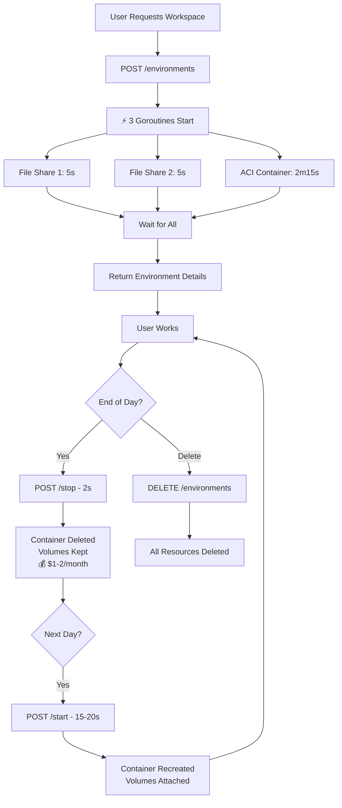

# Dev8 Agent API - Comprehensive Documentation

**Created:** 2025-10-27  
**Version:** 1.0.0  
**Base URL:** `http://localhost:8080`

---

## 📋 Table of Contents

1. [Overview](#overview)
2. [Architecture](#architecture)
3. [Performance Benchmarks](#performance-benchmarks)
4. [Cost Optimization](#cost-optimization)
5. [API Endpoints](#api-endpoints)
6. [Request/Response Examples](#request-response-examples)
7. [Error Handling](#error-handling)
8. [Workflows](#workflows)
9. [Postman Collection](#postman-collection)

---

## 🌟 Overview

Dev8 Agent is a stateless Go microservice that orchestrates Azure Container Instances (ACI) for cloud development environments.

### Key Features

- ⚡ **Maximum Concurrency**: Goroutines for parallel operations
- 🐳 **Azure Container Registry**: Fast image pulls from ACR
- 💰 **Cost-Optimized**: 95% savings when stopped
- 🔒 **Secure**: Per-workspace secrets (GitHub, SSH, AI keys)
- 📊 **Observable**: Detailed performance logging

### Architecture Principles

- **Stateless**: No database, Next.js is source of truth
- **Concurrent**: File shares + ACI created simultaneously
- **Resilient**: Automatic cleanup on failures
- **Fast Restart**: 15-20s with volume reuse

---

## 🏗️ Architecture

### Resource Naming Convention

All Azure resources use workspace UUID from Next.js database:

```
Workspace ID: clxxx-yyyy-zzzz-aaaa-bbbb

Generated Resources:
├─ ACI Container:    aci-clxxx-yyyy-zzzz-aaaa-bbbb
├─ DNS Label:        ws-clxxx-yyyy-zzzz-aaaa-bbbb
├─ Workspace Share:  fs-clxxx-yyyy-zzzz-aaaa-bbbb
└─ Home Share:       fs-clxxx-yyyy-zzzz-aaaa-bbbb-home

FQDN: ws-clxxx-yyyy-zzzz-aaaa-bbbb.centralindia.azurecontainer.io
```

### Concurrent Operations (Create Workspace)

```
┌─────────────────────────────────────────────────────┐
│               START ALL 3 OPERATIONS                │
│                   (Goroutines)                      │
└─────────────────────────────────────────────────────┘
                        │
        ┌───────────────┼───────────────┐
        │               │               │
        ▼               ▼               ▼
┌───────────────┐ ┌───────────────┐ ┌──────────────────┐
│ File Share 1  │ │ File Share 2  │ │  ACI Container   │
│  (workspace)  │ │    (home)     │ │                  │
│     ~5s       │ │     ~5s       │ │     ~2m15s       │
└───────────────┘ └───────────────┘ └──────────────────┘
        │               │               │
        └───────────────┼───────────────┘
                        ▼
              ⏱️ Total: ~2m15s
        (slowest operation wins)
```

---

## ⚡ Performance Benchmarks

### Operation Times

| Operation            | Time       | Notes                      |
| -------------------- | ---------- | -------------------------- |
| **Create Workspace** | 2m10-2m15s | All operations concurrent  |
| **Start Workspace**  | 15-20s     | ⚡ Reuses existing volumes |
| **Stop Workspace**   | 2s         | Deletes container only     |
| **Delete Workspace** | 5s         | Removes all resources      |

### Create Workspace Breakdown

```
Operation                  Time        Concurrent?
────────────────────────────────────────────────────
Workspace File Share       ~5s         ✅ Yes
Home File Share            ~5s         ✅ Yes
ACI Container Provision    ~2m15s      ✅ Yes
FQDN Assignment           ~3s         ❌ No (sequential)
────────────────────────────────────────────────────
TOTAL                     ~2m18s
```

### Why 2+ Minutes?

**Azure ACI provisioning is the bottleneck:**

- VM infrastructure allocation
- Container image pull (even from ACR)
- Network interface creation
- Public IP/DNS assignment
- Container startup

**This is Azure's infrastructure time - cannot be optimized further.**

---

## 💰 Cost Optimization

### Cost Comparison

| State       | Monthly Cost   | Annual Cost      |
| ----------- | -------------- | ---------------- |
| **Running** | $35/workspace  | $420/workspace   |
| **Stopped** | $1-2/workspace | $12-24/workspace |
| **Savings** | **95%** 🎉     | **95%** 🎉       |

### Stop/Start Workflow

```
1️⃣ CREATE (First Time)
   ↓ 2m15s
   💰 $35/month (running)

2️⃣ WORK (Active Development)
   ↓
   💰 $35/month (while running)

3️⃣ STOP (End of Day)
   ↓ 2s - Container deleted
   💰 $1-2/month (volumes only)

4️⃣ START (Next Day)
   ↓ 15-20s - Container recreated
   💰 $35/month (running again)
   ✅ All files preserved!
```

### Cost Calculation Examples

**Scenario 1: Always Running**

- 1 workspace × 24/7 × 30 days = **$35/month**

**Scenario 2: Work Hours Only (8h/day)**

- 1 workspace × 8h/day × 22 workdays = **~$11/month**
- Savings: **$24/month (69%)**

**Scenario 3: Weekend Break**

- Stop Friday → Start Monday = **$6 saved/month**

---

## 🔌 API Endpoints

### Base URL

```
Production: https://your-agent-domain.com
Development: http://localhost:8080
```

### Endpoint Overview

| Method | Endpoint                             | Description      | Time    |
| ------ | ------------------------------------ | ---------------- | ------- |
| GET    | `/health`                            | Health check     | <1s     |
| GET    | `/ready`                             | Readiness probe  | <1s     |
| GET    | `/live`                              | Liveness probe   | <1s     |
| POST   | `/api/v1/environments`               | Create workspace | ~2m15s  |
| POST   | `/api/v1/environments/start`         | Start workspace  | ~15-20s |
| POST   | `/api/v1/environments/stop`          | Stop workspace   | ~2s     |
| DELETE | `/api/v1/environments`               | Delete workspace | ~5s     |
| POST   | `/api/v1/environments/{id}/activity` | Report activity  | <1s     |

---

## 📝 Request/Response Examples

### 1. Health Check

**Request:**

```http
GET /health HTTP/1.1
Host: localhost:8080
```

**Response (200 OK):**

```json
{
  "status": "healthy",
  "timestamp": "2025-10-27T14:30:00Z",
  "uptime": "2h30m15s"
}
```

---

### 2. Create Workspace

**Request:**

```http
POST /api/v1/environments HTTP/1.1
Host: localhost:8080
Content-Type: application/json

{
  "workspaceId": "clxxx-yyyy-zzzz-aaaa-bbbb",
  "userId": "user_12345",
  "name": "My Development Workspace",
  "cloudProvider": "AZURE",
  "cloudRegion": "centralindia",
  "cpuCores": 2,
  "memoryGB": 4,
  "storageGB": 20,
  "baseImage": "node",

  // Optional per-workspace secrets
  "githubToken": "ghp_xxxxxxxxxxxxxxxxxxxx",
  "codeServerPassword": "SecurePassword123!",
  "sshPublicKey": "ssh-rsa AAAAB3NzaC1yc2EAAAADAQABAAABAQC...",
  "gitUserName": "John Doe",
  "gitUserEmail": "john@example.com",
  "anthropicApiKey": "sk-ant-xxxxxxxxxxxx",
  "openaiApiKey": "sk-xxxxxxxxxxxx",
  "geminiApiKey": "AIzaxxxxxxxxxx"
}
```

**Response (201 Created) - After ~2m15s:**

```json
{
  "success": true,
  "message": "Workspace created successfully",
  "data": {
    "environment": {
      "id": "clxxx-yyyy-zzzz-aaaa-bbbb",
      "name": "My Development Workspace",
      "userId": "user_12345",
      "status": "RUNNING",
      "cloudRegion": "centralindia",
      "cpuCores": 2,
      "memoryGB": 4,
      "storageGB": 20,
      "baseImage": "node",
      "azureResourceGroup": "dev8-rg-centralindia",
      "azureContainerGroup": "aci-clxxx-yyyy-zzzz-aaaa-bbbb",
      "azureFileShare": "fs-clxxx-yyyy-zzzz-aaaa-bbbb",
      "azureFqdn": "ws-clxxx-yyyy-zzzz-aaaa-bbbb.centralindia.azurecontainer.io",
      "connectionUrls": {
        "vscode": "http://ws-clxxx-yyyy-zzzz-aaaa-bbbb.centralindia.azurecontainer.io:8080",
        "ssh": "ssh -p 2222 dev8@ws-clxxx-yyyy-zzzz-aaaa-bbbb.centralindia.azurecontainer.io"
      },
      "createdAt": "2025-10-27T14:30:00Z",
      "updatedAt": "2025-10-27T14:32:15Z"
    },
    "message": "Your development environment is ready to use"
  }
}
```

**Agent Logs:**

```
2025/10/27 14:30:00 🚀 Creating workspace clxxx-yyyy-zzzz-aaaa-bbbb (region: centralindia)
2025/10/27 14:30:00 🐳 Using Azure Container Registry: dev8prodcr.azurecr.io/dev8-workspace:latest
2025/10/27 14:30:00 ⚡⚡⚡ Starting CONCURRENT creation (shares + container)...
2025/10/27 14:30:00 📁 [1/3] Creating workspace volume: fs-clxxx-yyyy-zzzz-aaaa-bbbb (20GB)
2025/10/27 14:30:00 📁 [2/3] Creating home volume: fs-clxxx-yyyy-zzzz-aaaa-bbbb-home (5GB)
2025/10/27 14:30:00 📦 [3/3] Creating ACI container: aci-clxxx-yyyy-zzzz-aaaa-bbbb
2025/10/27 14:32:15 ⚡⚡⚡ ALL OPERATIONS COMPLETED in 2m15s
2025/10/27 14:32:18 ⚡⚡⚡ WORKSPACE READY in 2m18s (all operations ran concurrently!)
2025/10/27 14:32:18 ✅ Workspace clxxx-yyyy-zzzz-aaaa-bbbb: ws-clxxx-yyyy-zzzz-aaaa-bbbb.centralindia.azurecontainer.io
```

---

### 3. Start Workspace (Fast Restart)

**Request:**

```http
POST /api/v1/environments/start HTTP/1.1
Host: localhost:8080
Content-Type: application/json

{
  "workspaceId": "clxxx-yyyy-zzzz-aaaa-bbbb",
  "cloudRegion": "centralindia",

  // Required for container recreation
  "userId": "user_12345",
  "name": "My Development Workspace",
  "cpuCores": 2,
  "memoryGB": 4,
  "storageGB": 20,
  "baseImage": "node",

  // Secrets (same as create)
  "codeServerPassword": "SecurePassword123!",
  "githubToken": "ghp_xxxxxxxxxxxxxxxxxxxx"
}
```

**Response (200 OK) - After ~15-20s:**

```json
{
  "success": true,
  "message": "Workspace started successfully",
  "data": {
    "environment": {
      "id": "clxxx-yyyy-zzzz-aaaa-bbbb",
      "status": "RUNNING",
      "azureFqdn": "ws-clxxx-yyyy-zzzz-aaaa-bbbb.centralindia.azurecontainer.io",
      "connectionUrls": {
        "vscode": "https://ws-clxxx-yyyy-zzzz-aaaa-bbbb.centralindia.azurecontainer.io"
      }
    },
    "message": "Your workspace is now running with existing data"
  }
}
```

**Agent Logs:**

```
2025/10/27 15:00:00 🚀 Starting workspace clxxx-yyyy-zzzz-aaaa-bbbb (checking volumes...)
2025/10/27 15:00:01 ✅ Volumes verified: workspace=fs-clxxx-..., home=fs-clxxx-...-home
2025/10/27 15:00:01 📦 Creating new container instance with existing volumes...
2025/10/27 15:00:18 ✅ Workspace clxxx-yyyy-zzzz-aaaa-bbbb started successfully (reused existing volumes)
```

---

### 4. Stop Workspace (Cost Savings)

**Request:**

```http
POST /api/v1/environments/stop HTTP/1.1
Host: localhost:8080
Content-Type: application/json

{
  "workspaceId": "clxxx-yyyy-zzzz-aaaa-bbbb",
  "cloudRegion": "centralindia"
}
```

**Response (200 OK) - After ~2s:**

```json
{
  "success": true,
  "message": "Workspace stopped successfully",
  "data": {
    "workspaceId": "clxxx-yyyy-zzzz-aaaa-bbbb",
    "message": "Container deleted, volumes preserved. Restart anytime to resume work."
  }
}
```

**Agent Logs:**

```
2025/10/27 18:00:00 🛑 Stopping workspace clxxx-yyyy-zzzz-aaaa-bbbb: DELETING container (keeping volumes)
2025/10/27 18:00:02 ✅ Workspace clxxx-yyyy-zzzz-aaaa-bbbb stopped (container deleted, volumes persisted for fast restart)
```

---

### 5. Delete Workspace (Permanent)

**Request:**

```http
DELETE /api/v1/environments HTTP/1.1
Host: localhost:8080
Content-Type: application/json

{
  "workspaceId": "clxxx-yyyy-zzzz-aaaa-bbbb",
  "cloudRegion": "centralindia",
  "force": false
}
```

**Response (200 OK) - After ~5s:**

```json
{
  "success": true,
  "message": "Workspace deleted permanently",
  "data": {
    "workspaceId": "clxxx-yyyy-zzzz-aaaa-bbbb",
    "message": "All data and resources have been permanently removed"
  }
}
```

**Error (409 Conflict) - If running without force:**

```json
{
  "success": false,
  "error": "Conflict",
  "message": "workspace clxxx-yyyy-zzzz-aaaa-bbbb is still running. Stop it first or use force=true",
  "code": "ERR_409"
}
```

---

## ❌ Error Handling

### HTTP Status Codes

| Code | Meaning               | Example                    |
| ---- | --------------------- | -------------------------- |
| 200  | OK                    | Operation successful       |
| 201  | Created               | Workspace created          |
| 400  | Bad Request           | Invalid input              |
| 404  | Not Found             | Workspace/volume not found |
| 409  | Conflict              | Container already exists   |
| 500  | Internal Server Error | Azure API failure          |
| 501  | Not Implemented       | Stateless endpoints        |

### Error Response Format

```json
{
  "success": false,
  "error": "Error Category",
  "message": "User-friendly explanation",
  "code": "ERR_404"
}
```

### Common Error Scenarios

#### 1. Create: Invalid WorkspaceID

**Request:**

```json
{
  "workspaceId": "short",
  "name": "Test"
}
```

**Response (400):**

```json
{
  "success": false,
  "error": "Invalid Request",
  "message": "workspaceId must be a valid UUID",
  "code": "ERR_400"
}
```

#### 2. Start: Volumes Not Found

**Response (404):**

```json
{
  "success": false,
  "error": "Resource Not Found",
  "message": "workspace volume not found: fs-clxxx-yyyy-zzzz. Create environment first.",
  "code": "ERR_404"
}
```

#### 3. Stop: Container Not Running

**Response (404):**

```json
{
  "success": false,
  "error": "Resource Not Found",
  "message": "container not found for workspace clxxx-yyyy-zzzz. Already stopped?",
  "code": "ERR_404"
}
```

---

## 🔄 Workflows

### Complete Lifecycle Workflow



### Error Handling Workflow

```
CREATE Workspace
├─ If File Share 1 fails
│  └─ Cleanup: Delete File Share 2, Delete ACI
├─ If File Share 2 fails
│  └─ Cleanup: Delete File Share 1, Delete ACI
└─ If ACI fails
   └─ Cleanup: Delete both File Shares
```

---

## 📦 Postman Collection

### Import Collection

**Collection ID:** `ebc0c5ae-d173-42f2-8497-6d3afedeacd1`

**Public URL:** https://www.postman.com/vpatil5212/dev8-agent-api

### Collection Structure

```
Dev8 Agent API
├── 01 - Health & Monitoring
│   ├── Health Check
│   ├── Readiness Check
│   └── Liveness Check
├── 02 - Workspace Lifecycle
│   ├── Create Workspace
│   ├── Start Workspace (Fast Restart)
│   ├── Stop Workspace (Cost Savings)
│   ├── Delete Workspace
│   └── Report Activity
└── Environment Variables
    ├── baseUrl: http://localhost:8080
    └── workspaceId: clxxx-yyyy-zzzz-aaaa-bbbb
```

---

## 🚀 Quick Start

### 1. Start Agent

```bash
cd /home/vsing/code/Dev8.dev/apps/agent
./agent
```

### 2. Test Health

```bash
curl http://localhost:8080/health
```

### 3. Create Workspace

```bash
curl -X POST http://localhost:8080/api/v1/environments \
  -H "Content-Type: application/json" \
  -d '{
    "workspaceId": "test-workspace-001",
    "userId": "user123",
    "name": "Test Workspace",
    "cloudRegion": "centralindia",
    "cpuCores": 2,
    "memoryGB": 4,
    "storageGB": 20,
    "baseImage": "node"
  }'
```

### 4. Stop Workspace (Save Costs)

```bash
curl -X POST http://localhost:8080/api/v1/environments/stop \
  -H "Content-Type: application/json" \
  -d '{
    "workspaceId": "test-workspace-001",
    "cloudRegion": "centralindia"
  }'
```

### 5. Start Workspace (Fast!)

```bash
curl -X POST http://localhost:8080/api/v1/environments/start \
  -H "Content-Type: application/json" \
  -d '{
    "workspaceId": "test-workspace-001",
    "cloudRegion": "centralindia",
    "userId": "user123",
    "name": "Test Workspace",
    "cpuCores": 2,
    "memoryGB": 4,
    "storageGB": 20,
    "baseImage": "node"
  }'
```

---

## 📊 Performance Tips

1. **First Create**: Accept 2m15s (Azure limitation)
2. **Use Stop/Start**: Get 15-20s restarts
3. **Stop When Idle**: Save 95% cost
4. **Monitor Logs**: Track concurrent operations
5. **ACR Images**: Already optimized

---

## 🔒 Security Best Practices

1. **Never log secrets**: Tokens masked in logs
2. **Per-workspace secrets**: Isolated credentials
3. **HTTPS only**: Production connections
4. **Volume encryption**: Azure handles it
5. **Network isolation**: Private networking (future)

---

## 📞 Support

- **Documentation**: This file
- **Issues**: GitHub Issues
- **Email**: support@dev8.dev
- **Postman Collection**: Import for testing

---

**Last Updated:** 2025-10-27  
**Agent Version:** 1.0.0  
**API Version:** v1
